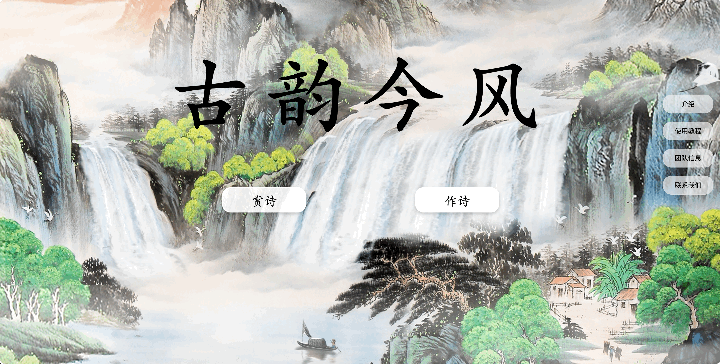
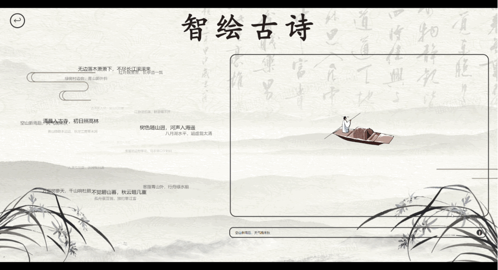
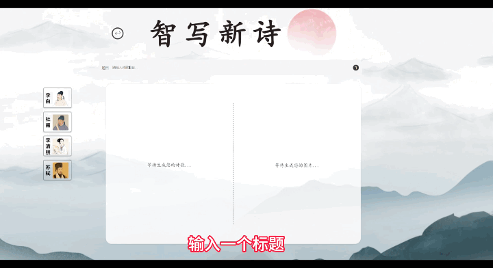

# 古韵今风 · 古诗词大模型

> 将中华古诗词文化与大模型技术结合，提供古诗赏析、诗词生成与诗意图像生成等能力。

## 项目简介

**“古韵今风”古诗词大模型**旨在将人工智能技术应用于中华古典诗词的学习、理解与创作场景。项目通过对中文大语言模型和文生图模型进行针对性微调，并将模型能力接入 HTML 交互界面，让用户可以更直观地学习古诗词、理解诗意，并尝试进行古诗创作。

系统目前包含一个主界面和两个核心功能界面：

- **赏诗 / 智绘古诗**：输入或选择古诗词句，由模型生成诗词解析，并结合诗句意境生成对应图像。
- **作诗 / 智写新诗**：输入诗歌题目并选择创作风格，由模型生成对应风格的古诗词，同时生成配套图片。

## 核心功能

### 1. 主界面

主界面作为系统入口，提供“赏诗”和“作诗”两个主要功能入口，并包含相关项目介绍信息。



### 2. 智绘古诗

进入“赏诗”功能后，用户可以：

- 从左侧 3D 动态诗句云中选择诗句；
- 在输入框中自行输入古诗词句；
- 获取模型生成的诗词解析结果；
- 根据诗句意境生成对应图像。



### 3. 智写新诗

进入“作诗”功能后，用户可以：

- 输入诗歌标题；
- 选择对应的创作风格；
- 生成古诗词内容；
- 同步生成与诗词意境相匹配的图片。



## 技术方案

### 数据集

项目使用了以下开源古诗词数据集，并选取其中部分数据用于模型微调：

- **Classic Chinese Poem with Annotation**（Kaggle）
- **Chinese-poetry**（GitHub）

数据内容包括大量古诗词、译文、注释与解析信息，为诗词理解和生成任务提供训练语料。

### 模型

项目共训练 / 微调了 3 个模型：

- **2 × llama3-Chinese-8B**
  - 用于古诗词知识问答与诗词解析；
  - 用于古诗词生成与风格化创作。
- **1 × Stable Diffusion**
  - 用于根据古诗词语义生成对应图像。

### 微调方法

#### LLM 微调

项目采用 **LoRA（Low-Rank Adaptation）** 对 `llama3-Chinese-8B` 进行微调，以提升模型在古诗词知识、诗词解析和诗词生成任务上的表现。

在示例测试中，对于“白日依山尽，黄河入海流”，微调后的模型能够正确识别其出自王之涣《登鹳雀楼》，并给出更完整的译文与背景信息。

#### Stable Diffusion 微调

针对原始 Stable Diffusion 对古诗文语义和意境理解不足的问题，项目对模型中的 **CLIP 语言模块**进行了微调，使模型能够更准确地理解古诗词描述，并生成与诗句意境更加贴合的图像。

#### 古诗生成训练

诗词生成模型在训练时将数据划分为不同输入形式：

- 带作者 / 风格信息的数据；
- 不指定作者的通用数据。

通过这种方式，模型既可以进行通用古诗生成，也可以根据指定诗人或风格进行创作。

## 系统架构

当前项目采用前后端分离式思路：

```text
用户
  │
  ▼
HTML 交互界面
  │
  │ API 请求
  ▼
服务器端模型推理服务
  ├── llama3-Chinese-8B：诗词解析 / 知识问答
  ├── llama3-Chinese-8B：诗词生成
  └── Stable Diffusion：诗意图像生成
```

由于模型体积较大，模型推理过程部署在服务器端，前端通过 API 与模型服务进行通信。

## 使用说明

1. 启动或连接服务器端模型推理服务。
2. 在前端项目中配置对应的 API 地址。
3. 打开 HTML 项目入口页面。
4. 在主界面选择：
   - **赏诗**：进行诗词解析与诗意图像生成；
   - **作诗**：进行指定主题 / 风格的古诗词生成。

> 原始项目说明中未提供具体依赖文件、启动脚本、API 路由和运行命令。将代码上传 GitHub 后，建议根据仓库实际结构进一步补充“环境安装”“后端启动”“前端启动”和“API 配置”等内容。

## 使用注意事项

- 生成过程中请勿在短时间内重复点击“生成”按钮，以避免服务器并发压力过大。
- 项目通过网络 API 调用服务器端模型，网络不稳定时可能出现前端与后端连接失败。
- 大语言模型仍可能产生幻觉或不准确内容，诗词知识与生成结果建议结合可靠资料进行核验。

## 当前效果

项目文档中的训练前后对比显示：

- LoRA 微调后，模型在古诗词作者、作品信息和解析内容上的准确性有所提升；
- CLIP 微调后，文生图模型对古诗文意境的理解和图像匹配度有所改善；
- 古诗生成模型在微调后，生成结果在格式、内容丰富度和韵脚表现方面更加稳定。

## 后续计划

- 扩充古诗词训练数据集，提高模型知识覆盖范围；
- 优化微调方案，进一步降低模型幻觉；
- 提升古诗词生成的格律、押韵和风格一致性；
- 改进诗句与生成图像之间的语义对齐；
- 完善前后端部署方式与交互体验；
- 增加更多诗人、朝代、体裁和主题的可控生成能力。

## 数据与开源说明

本项目使用了第三方开源数据集和基础模型。若将项目公开发布到 GitHub，请在正式开源前确认并遵守：

- `llama3-Chinese-8B` 对应基础模型的许可证；
- Stable Diffusion 对应版本的模型许可证；
- `Classic Chinese Poem with Annotation` 数据集的授权条款；
- `Chinese-poetry` 数据集的开源协议。

建议在仓库根目录补充独立的 `LICENSE` 文件，并在本节中列出各数据集和基础模型的原始项目链接。

## 联系方式

如在使用过程中遇到模型服务连接或生成问题，可联系：

- Email: `pengyixiang@stu.cqut.edu.cn`

## 致谢

感谢古诗词开源数据集、中文大语言模型以及 Stable Diffusion 等开源社区项目，为本项目的训练与实现提供基础支持。

---

如果你对本项目感兴趣，欢迎通过 Issue 或 Pull Request 交流和改进。
